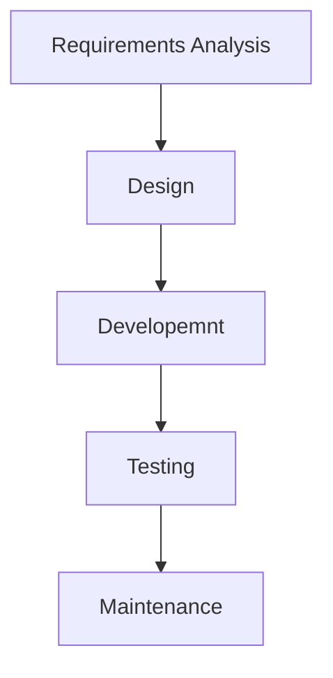
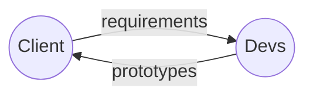
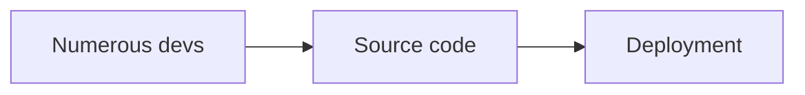

# CI/CD For Beginners

**incomplete**

## Lesson 1: Introduction to DevOps {collapsible="true" default-state="expanded"}

### Waterfall Model

- traditional approach to software development
- development happens in a step-by-step process

#### Requirements Analysis

- programmers accept teh client requirements and analyze it

#### Design

- programmers then come up with a project plan and a design architecture

#### Development

- programmers code the application as per project plan and design

#### Testing

- ensure the application is error-free and meets the requirements

#### Maintenance

- operations team monitors the application

❗❗❗ **Disadvantages**

- any new requirements from the client will restart the development cycle
- if the client is unhappy with the product, the entire project cycle is restarted

### Agile Method

- programmers create prototypes to understand client requirements

_Feedback Loop_

- the entire process of building an application is broken down into small actionable blocks called sprints

**✔✔✔ Advantages**

- client requirements are better understood because of the constant feedback
- the product is delivered much faster as compared to a waterfall model

❗❗❗ **Disadvantages**

- product gets tested only on developer computers and not on production systems
- developers and operations team work in silos
    - developers submit the product to operations team for deployment
    - if the product fails in production servers, the operations team are clueless and send product back to development

### What is DevOps?

- devops is an evolution from Agile model
- addresses the gap between clients and developers

- the development team will submit the application to the operations team for implementation
- operations team will monitor the application and provide relevant feedback to developers

### DevOps Phases

1. **Plan**: business owners and software development team discuss project goals and create a plan
2. **Code**: programmers then design and code the application and use tools like **_Git_** to store application code
3. **Build**: tools like **_Maven_** and **_Gradle_** take code from different repositories and combine them to build
   the complete application
4. **Test**: application is tested using automation testing tools like **_Selenium_** and **_JUnit_** to ensure software
   quality
5. **Integrate**: new features are integrated automatically to the already existing code base (**_Jenkins_**)
6. **Deploy**: application is packaged after release and deployed from development server to production server
7. **Operate**: once deployed, an operations team performs activities such as configuring servers adn provisioning them
   with the required resources (**_Chef_** and **_Ansible_**)
8. **Monitoring**: allow IT organization to identify specific issues of specific releases and understand the impact on
   end users

### DevOps Advantages

- time taken to create and deliver software is reduced
- the complexity of maintaining the application is reduced
    - improved collaboration between development and operations teams
    - continuous integration and delivery ensure faster time to market

## Lesson 2: What is Ci/CD Pipeline? {collapsible="true" default-state="expanded"}

### Overview of Continuous Integration

- a development practice of code integration into a shared repository
- each integration is verified by an automated build and automated tests

#### CI Process

1. Develop and compile
2. Preform unit tests
3. Integrate with databases
4. Perform pre-production deployment
5. Perform functional test and code labeling
6. Generate reports and analyze

- developers must write unit tests that exercise each line of code
- standard feature of CI is to have the process run all the unit tests in teh devs work branch before merging teh code
  into a common code base
    - if it fails a single test, then the code is **NOT** merged into the common code base

### Overview of Continuous Deployment

- an extension of CI
- aims to reduce the time the development team takes between writing one new line of code and using it in production
- for the most part CD is a highly automated process
- scripts take over manual work during deployment
    - create the computing environment before deployment
- automation reduces teh time it takes for code delivered from developer to end user and increase teh accuracy fo the
  code

#### Benefits

- faster feedback from end users on each new feature as it is released to production
- faster ROI for each feature as it gets development

### Popular Tools in CI/CD

- Jenkins
- Travis CI
- Bamboo
- Team City
- Gitlab

### Continuous Integration with Jenkins

- over 1000 plugins
- integration with over 100 DevOps tools
- orchestration of the DevOps tool chain
- end-to-end CD pipeline management

#### Typical Phases

1. Code and commit - IDEs, Git, GitLab
2. Build and config - Maven, Gradle, Docker, Chef, Puppet, Ansible
3. Scan and test - JUnit, Cucumber, Sonar, Selenium
4. Release - uDeploy, CollabNet, Serena, MidVision, XLRelease
5. Deploy - Docker, .Net, Azure, AWS, OpenStack, JMWare

### Continuous Deployment with Jenkins

#### Operational Stages

1. Code terminal
2. Storage
3. QA
4. Testing
5. Production

### Continuous Integration with Team City

- from JetBrains

### Continuous Deployment with Team City

## Lesson 3: What is Jenkins? {collapsible="true" default-state="expanded"}

### Jenkins as a Continuous Integration Tool

- Java-based, open-source automation tool
- functions as a server and is a software development and cross-platform tool used for CI/CD

#### CI Server

- can be used as a CI server
- can be used as a CD hub for a project

#### Distribution

- easily distribute work across different machines and help trigger build, tests, and deployments to multiple machines
  and platforms faster

#### Cross-platform

- IOS, .Net, Android development, Ruby and Java

### Architecture of Jenkins

- jenkins has classes like project and build
- uses Jelly as the view technology
- uses a file system to store its data
    - directories are created inside `$JENKINS_HOME`
- supports plugins which can plug into those extension points and extend the capabilities of Jenkins

### Popular Features of Jenkins

1. platform independent
2. rich plugin ecosystem
3. support from large communities
4. scaling of large error-ridden integrations
5. automation integration enabling immediate detection and resolution of issues
6. open-source and user-friendly
7. easy to configure, modify adn extend

### Build Status and Job Health

Summarize what the reader achieved by completing this tutorial.

<seealso>
<!--Give some related links to how-to articles-->
</seealso>
