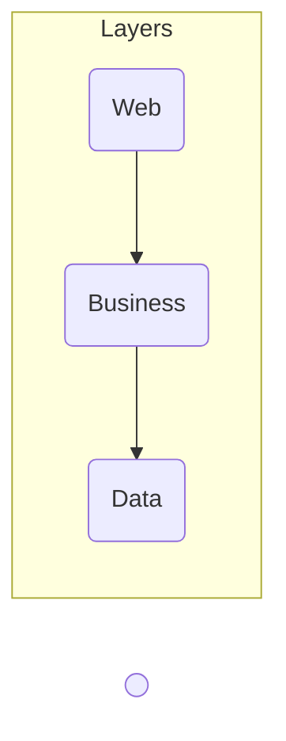

# Docker Containers and Kubernetes Fundamentals

**incomplete**

## Introduction to Microservices {collapsible="true" default-state="expanded"}

### Microservices Concepts

#### Microservice Architecture

- services are fine-grained and the protocols are lightweight

#### Monolithic Architecture

- built as a single unit
- deployed as a single unit
- duplicated on each server

Example:




#### Microservices

- segregates functionality into smaller separate services each with a single responsibility
- scales out by deploying each service independently
- loosely coupled
- enable autonomous development by different teams, languages and platforms
- it can be written by smaller teams
- each microservice can own its own data/database


#### From Monolith to Microservices

- break your application/system into small units
- use the [Strangler pattern](https://martinfowler.com/bliki/StranglerFigApplication.html)


[https://learn.microsoft.com/en-us/azure/architecture/patterns/strangler-fig](https://learn.microsoft.com/en-us/azure/architecture/patterns/strangler-fig)

### Microservices Anti Patterns

- Microservices != Magic Pixey Dust
- The more, the merrier
    - risk of unnecessary complexity
    - risk that changes impact numerous services
    - risk of complex security

### Microservices Advantages and Drawbacks

#### Benefits

- improved fault isolation
- eliminate vendor or technology lock-in
- ease of understanding
- smaller and faster deployments
- scalability

#### Drawbacks

- complexity is added to resolve complexity issues
    - is your team trained, ready and has made POCs?
    - don't start with a complex infrastructure
- testing may appear simpler, but is it?
- deployment may appear simpler, but is it?
    - hard to do with multiple teams
    - one microservice update can impact many microservices
- multiple databases?
- latency issues
- transient errors
- multiple point of failures
- how about security?

## Welcome to Cloud Native! {collapsible="true" default-state="expanded"}

- within a short time, cloud native has become a driving trend in the software industry
    - it's a new way to think about building complex systems
    - takes full advantage of modern software development practices, technologies, and cloud infrastructure
    - widely popular in the open-source communities

Definition:

- uses containers, service meshes, microservices, immutable infrastructure and declarative APIs
- enable loosely coupled systems
- resilient, manageable and observable
- robust automation
- make high-impact changes frequently
- ecosystem of open source, vendor neutral projects


[https://landscape.cncf.io/](https://landscape.cncf.io/)

### Cloud Native Concepts

#### Speed and Agility

- Users want...
    - instantaneous responsiveness
    - up-to-the-minute features
    - no downtime
- Businesses want...
    - accelerate innovation
    - rapid releases of features to meet disruption from competitors
    - increase confidence-stability/performance

#### Application Architecture


#### Mentality: Pets vs Cattle

- infrastructure becomes immutable and disposable
- provisioned in minutes and destroyed on demand
- never updated or repaired but re-provisioned

#### CNCF Trail Map

- breaks the journey into measurable objectives
- set key performance indicators
    - measurable values


## Introduction to Containers {collapsible="true" default-state="expanded"}

### Container Concepts

#### What is a container?

- A unit of software/deployment
  

#### Why use containers?

- move faster by deploying smaller units
- user fewer resources
- fit more on a server
- faster automation
- portability
- isolation

#### What is virtualized?


#### VM vs Containers

| Virtual Machine              | Container                                 |
|------------------------------|-------------------------------------------|
| large footprint              | light weight                              |
| slow to boot                 | quick to start (it does not have to boot) |
| ideal for long running tasks | portable                                  |
|                              | ideal for short lived tasks               |

#### Density


#### Containers are made of layers


#### Container Registry

- centralized container repository

#### Orchestrator

- manage
    - infrastructure
    - containers
    - deployment
    - scaling
    - failover
    - health monitoring
    - apps upgrade, zero-downtime deployments
- install your own
    - Kubernetes, Swarm, Service Fabric
- orchestrators as a service
    - Azure Kubernetes Service, Service Fabric

### What is Docker?


- an open source container runtime
- Mac, Windows & Linux support
- command line tool
- "Dockerfile" file format for building container images
- Windows lets you run Windows and Linux containers

### Basic Commands

| Command          |                              |
|------------------|------------------------------|
| `docker info`    | Display system information   |
| `docker version` | Display the system's version |
| `docker login`   | Log in to a Docker Registry  |

### Running Containers

| Command                            |                                           |
|------------------------------------|-------------------------------------------|
| `docker pull [imageName]`          | Pull an image from registry               |
| `docker run [imageName]`           | Run containers                            |
| `docker run -d [imageName]`        | Detached mode                             |
| `docker start [containerName]`     | Start stopped containers                  |
| `docker ps`                        | List running containers                   |
| `docker ps -a`                     | List all containers (running and stopped) |
| `docker stop [containerName]`      | Stop containers                           |
| `docker kill [containerName]`      | Kill containers                           |
| `docker image inspect [imageName]` | Get image info                            |

- `[imageName]` is the name of the image that is in the container registry
- `[containerName]` is the name of the running container

#### Setting limits

| Command                           |            |
|-----------------------------------|------------|
| `docker run --memory="256m" ngix` | max memory |
| `docker run --cpus=".5" nginx`    | max cpu    |

```bash
# pull and run a nginx server
docker run --publish 8080:80 --name webserver nginx

# list the running containers
docker ps

# stop the container
docker stop webserver

# remove the container
docker rm webserver
```

#### Attach a shell

| Command                                                     |                                                   |
|-------------------------------------------------------------|---------------------------------------------------|
| `docker run -it nginx -- /bin/bash`                         | attach shell                                      |
| `docker run -it -- microsoft/powershell:nanoserverpwsh.exe` | attach powershell                                 |
| `docker container exec -it [containerName] -- bash`         | attach to a running container                     |
| `docker exec -it [containerName] bash`                      | alternate run a bash shell on a running container |

#### Cleaning up

| Command                        |                                                 |
|--------------------------------|-------------------------------------------------|
| `docker rm [containerName]`    | removes stopped container                       |
| `docker rm $(docker ps -a -q)` | removes all stopped containers                  |
| `docker images`                | list images                                     |
| `docker rmi [imageName]`       | deletes the image                               |
| `docker system prune -a`       | removes all images not in use by any containers |

### Building Containers

| Command                                    |                                                               |
|--------------------------------------------|---------------------------------------------------------------|
| `docker build -t [name:tag] .`             | builds an image using a Dockerfile located in the same folder |
| `docker build -t [name:tag] -f [fileName]` | builds an image using a Dockerfile in a different folder      |
| `docker tag [imageName] [name:tag]`        | tag an existing image                                         |

#### Dockerfile—static HTML site

```dockerfile
FROM nginx:alpine
COPY . /usr/share/nginx/html
```

- `FROM` line specifies the base image
- `COPY` copies everything from the current folder (`.`) to a specified folder inside the
  container (`/usr/share/nginx/html`)

```bash
# build
docker build -t webserver-image:v1 .

# run
docker run -d -p 8080:80 webserver-image:v1

# display
curl localhost:8080
```

#### Dockerfile - node site

```dockerfile
FROM alpine
RUN apk add -update nodejs nodejs-npm
COPY . /src
WORKDIR /src
RUN npm install
EXPOSE 8080
ENTRYPOINT ["node", "./app.js"]
```

#### Docker CLI - Tagging

- docker tag => Create a target image
    - name:tag
        - myimage:v1
    - repository/name:tag
        - myacr.azurecr.io/myimage:v1

<a href=""></a>

## Persisting Data {collapsible="true" default-state="expanded"}

### Containers are Ephemeris and Stateless

- short-lived
- you usually don't store data in containers
- non-persistent data
    - locally on a writable layer
    - it's the default, just write to the filesystem
    - when containers are destroyed, so is the data inside them
- Persist data
    - stored outside the container in a volume
    - a volume is mapped to a logical folder

#### Volumes

- maps a folder on the host to a logical folder in the container


### Docker Volumes Concepts

| Command                              |                                 |
|--------------------------------------|---------------------------------|
| `docker create volume [volumeName]`  | created a new volume            |
| `docker volume ls`                   | list the volumes                |
| `docker volume inspect [volumeName]` | display volume infor            |
| `docker volume rm [volumeName]`      | deletes a volume                |
| `docker volume prune`                | deletes all volumes not mounted |

#### Mapping a Volume

```bash
# create a volume
docker create volume myvol

# inspect the volume
docker volume inspect myvol

# list the volumes
docker volume ls

# run a container with a volume
docker run -d --name devtest -v myvol:/app nginx:latest
```

- `-v mvol:/app` mapping the volume to a logical folder

#### Mapping to a local folder

```bash
# run a container with a volume
docker run -d --name devtest -v d:/test:/app nginx:latest

# inspect the container
docker inspect devtest
```

- `d:/test` specifies the local folder

## Docker Compose {collapsible="true" default-state="expanded"}

### Understanding the YAML File Structure

- "YAML" -> YAML Ain't Markup Language
- a human-friendly data serialization language for all programming languages
- used by Docker-Compose and Kubernetes

```yaml
# Comments in YAML look like this

key: value
another_key: Another value goes here.
a_number_value: 100

# Nesting uses indentation. 2 space indents are preferred (but not required).
a_nest_map:
  key: value
  another_key: another value
  another_nest_map:
    hello: hello

# Sequences (equivalent to lists or arrays) look like this
# (note the '-' counts as an indentation):
a_sequence:
  - item1 # Indentation again!
  - item2

# Since YAML is a superset of JSON, you can also write JSON-style maps and sequences:
json_map: { "key": "value" }
json_seq: [ 3, 2, 1, "takeoff" ]
```

### Docker Compose Concepts

#### Multi Containers App


- define and run multi-containers applications
- define using a single YAML file
- run using the docker CLI with the Compose plugin
    - Docker Compose
- Compose specs
    - [https://compose-spec.io](https://compose-spec.io)

#### Compose V2

- GA at DockerCon Live 2022
- Incorporates the docker compose command into the Docker CLI
    - You type _docker compose_ instead of _docker-compose_
    - drop in replacement for Docker Compose V1
    - docker compose v2 commands maps directly to docker compose v1
- install the Docker Desktop
    - Linux: apt-get install docker compose-plugin
- written in Go
    - Docker Compose V1 written in Python

```yaml
version: '3.9'

services:
  webapi1:
    image: academy.azurecr.io/webapi1
    ports:
      - '8081:80'
    restart: always

  webapi2:
    image: academy.azurecr.io/webapi2
    ports:
      - '8082:80'
    restart: always

  apigateway:
    image: academy.azurecr.io/apigateway
    ports:
      - '8080:80'
    restart: always
```

#### Use Cases

- workloads that don't require a full orchestrator (such as Kubernetes)
- development and tests
- use of a service that can run docker compose files
    - Azure App Service
    - AWS ECS
    - virtual machines

### Using Docker Compose

#### Docker Compose Commands

| Command                                |                                |
|----------------------------------------|--------------------------------|
| `docker compose build`                 | build the images               |
| `docker compose start`                 | start the containers           |
| `docker compose stop`                  | stop the containers            |
| `docker compose up -d`                 | build & start                  |
| `docker compose ps`                    | list what's running            |
| `docker compose rm`                    | remove from memory             |
| `docker compose down`                  | stop and remove                |
| `docker compose logs`                  | get the logs                   |
| `docker compose exec [container] bash` | run a command in the container |

#### Projects


#### Docker Compose V2 - New Commands

| Command                                                  |                               |
|----------------------------------------------------------|-------------------------------|
| `docker compose --project-name test1 up -d`              | run an instance as a project  |
| `docker compose -p test2 up -d`                          | shortcut                      |
| `docker compose ls`                                      | list running projects         |
| `docker compose cp [containerId]:[SRC_PATH] [DEST_PATH]` | copy files from the container |
| `docker compose cp [SRC_PATH] [ContainerId]:[DEST_PATH]` | copy files to the container   |

```bash
# build the service
docker compose build

# bulids, (re)creates, starts, attaches to containers for a service
docker compose up

# list the services
docker compose ps

# bring down what was created by UP
docker compose down
```

### Docker Compose Features

#### Resource Limits

```yaml
services:
  redis:
    image: redis:alpine
    deploy:
      resources:
      limits:
        cpus: '0.5'
        memory: 150M
      reservations:
        cpus: '0.25'
        memory: 20M
```

In the above example, limits are what the container can use up to. Reservations are the initial allocation of resources.

#### Environment Variables

Inject an environment variable that will be in the running instance

```yaml
services:
  web:
    image: nginx:alpine
    environment:
      - DEBUG=1
      - FOO=BAR
```

These must be set for each service.

Can be overridden at the CLI

```bash
# set an environment variable
docker compose up -d -e DEBUG=0
```

```bash
# set an environment variable
export POSTGRES_VERSION=14.3

# powershell
$env:POSTGRES_VERSION= "14.3"
```

or in a `.env` file located in the same directory as the compose file.

`POSTGRES_VERSION=14.3`

```yaml
services:
  db:
    image: 'postgres:${POSTGRES_VERSION}'
```

#### Networking

By default, all containers specified in a Compose file will be able to see each other using their service name.

_single container networking_


_multi-container networking_


#### Dependence

```yaml
services:
  app:
    image: myapp
    depends_on:
      - db
  db:
    image: postgres
    networks:
      - back-tier
```

Since the app depends on db, compose will start up db service first and then start app

#### Volumes-named

```yaml
services:
  app:
    image: myapp
    depends_on:
      - db
  db:
    image: postgres
    volumes:
      - db-data:/etc/data
    networks:
      - back-tier

volumes:
  db-data:
```

- when mapping, you can also append `:ro` or `:rw` at the end of the virtual path where the volume is mapped

#### Volumes

```yaml
services:
  app:
    image: myapp
    depends_on:
      - db
  db:
    image: postgres
    volumes:
      - ./db:/etc/data
    networks:
      - back-tier
```

- declared at the service level

#### Restart Policy

```yaml
services:
  app:
    image: myapp
    restart: always
    depends_on:
      - db
  db:
    image: postgres
    restart: always
```

- no
    - this is the default restart policy
    - does not restart a container under any circumstances
- always
    - always restarts the container until its removal
- on-failure
    - restarts a container if the exit code indicates an error
- unless-stopped
    - restarts a container irrespective of the exit code but will stop restarting when the service is stopped or removed

## Container Registries {collapsible="true" default-state="expanded"}

### Container Registries Concepts

#### What are container registries?

- central repository for container images
- private or public
- Docker Hub
    - hub.docker.com
- Microsoft
    - Azure Container Registry
    - Microsoft Container Registry (public images)
        - mcr.microsoft.com
    - AWS Elastic Container Registry
    - Google Container Registry

### Push/Pull Images from Docker Hub

```bash
# login to Docker Hub
docker login -u <username> -p <password>

# tag the image previously built
docker tag my_image k8sacademy/my_image:latest

# push the image
docker push k8sacademy/my_image:latest

# pull the image
docker pull k8sacademy/my_image:latest
```

## Kubernetes Concepts {collapsible="true" default-state="expanded"}

### Kubernetes Concepts

- aka K8s (pronounced kates)
- originate from Google
- v1.0 released in July 2015
- 3rd generation container scheduler from Google
    - previous Google internal projects: Borg and Omega
- donated to the Cloud Native Computing Foundation (CNCF)
    - [www.cnfo.io](https://www.cncf.io/)

#### What is Kubernetes?

- K8s is the leading container orchestration tool
- designed as a loosely coupled collection of components centered around deploying, maintaining and scaling workloads
- vendor neutral
    - runs on all cloud providers
- backed by a huge community

#### What can K8s do?

- service discovery and load balancing
- storage orchestration
    - locally or cloud-based
- automated rollouts and rollbacks
- self-healing
- secret and configuration management
- use the same API across on-premise and every cloud provider

#### What K8s can't do?

- does not deploy source code
- does not build your application
- does not provide application-level services
    - message buses, databases, caches, etc.

#### K8s Architecture


[https://kubernetes.io/docs/concepts/overview/components](https://kubernetes.io/docs/concepts/overview/components/)


### How to Run Kubernetes Locally

#### Local K8s

- requires virtualization
    - Docker Desktop
    - MicroK8s
    - Minikube
- runs over Docker Desktop
    - Kind
- Limited to 1 node
    - Docker Desktop
- multiple nodes
    - MicroK8s
    - Kind
    - Minikube

#### Local K8s—Windows

- Docker Desktop is currently the only way to run both Linux and Windows containers
- Docker Desktop can run on Hyper-V or WSL 2 (Windows 10 2004)
- If Hyper-V is enabled, you can't run another hypervisor at the same time
- You can install Minikube on Hyper-V of VirtualBox

#### Docker Desktop - macOS

- run in a LinuxKit VM using the HyperKit lightweight hypervisor

#### Minikube

- does not require Docker Desktop
- installs on Linux, macOS, and Windows
    - [https://minikube.sigs.k8s.io/docs/start/](https://minikube.sigs.k8s.io/docs/start/)
- a hypervisor like VirtualBox is required

##### Minikube on macOS

- install Minikube using Homebrew

##### Minikube Hyper-V Installation

- in a Window terminal or Powershell prompt as admin
- install the Chocolately package manager
- Run: choco install minikube
- create a network switch
    - `New-VM-Switch-Name " MinikubeNAT" -AllowManagement$True-NetAdapterName"<adapter_name>"`
- start Minikube
    - `minikube start --vm-driver hyper --hyper-virtual-switch "MinikubeNAT"`
- switch context
    - `kubectl config use-context minikube`

#### Kind

- Kubernetes in Docker
    - [https://kind.sigs.k8s.io/docs/user/quick-start/](https://kind.sigs.k8s.io/docs/user/quick-start/)
- runs on macOS, Linux and Windows
- only requires Docker installed
    - no need for another VM installation
    - install the nodes as containers
- Windows installation via Chocolately
    - `choco install kind`
- MacOS install via Homebrew
    - `brew install kind`
- multi nodes
- High-Availability Control Plane
- define in YAML

```yaml
# HA-config.yaml
kind: Cluster
apiVersion: kind.sigs.k8s.io/v1alpha3
nodes:
  - role: control-plane # this is a master node (required)
  - role: worker
  - role: worker
  - role: worker
```

### Kubernetes API


#### CLI

- kubectl
- pronounced (pick your choice)
    - kube control
    - kube kuttle
    - kube c-t-l
- communicates with the api server
- configuration stored locally
    - ${HOME}/.kube/config
    - C:\Users\{USER}\.kube\config

### The Declarative Way vs the Imperative Way

## Namespaces {collapsible="true" default-state="expanded"}

### Namespaces Concepts

## Nodes {collapsible="true" default-state="expanded"}

### Master Node Concepts

### Worker Nodes Concepts

## Pods {collapsible="true" default-state="expanded"}

### Pod Concepts

### The Pod Lifecycle

### Defining and Running Pods

### Init Containers

## Selectors {collapsible="true" default-state="expanded"}

### Selector Concepts

## Multi Container Pods {collapsible="true" default-state="expanded"}

### Common Patterns for Running More than One Container in a Pod

### Multi Container Pods Networking Concepts

## Workloads {collapsible="true" default-state="expanded"}

### Introduction to Workloads

### ReplicaSet Concepts

### Deployment Concepts

### DaemonSet Concepts

### StatefulSet Concepts

### Job Concepts

### CronJob Concepts

## Updates {collapsible="true" default-state="expanded"}

### Rolling Updates Concepts

### Blue-Green Deployments

## Services {collapsible="true" default-state="expanded"}

### What are services?

### ClusterIP Concepts

### NodePort Concepts

### Load Balancer Concepts

## Storage & Persistence {collapsible="true" default-state="expanded"}

### Storage & Persistence Concepts

### The Static Way

### The Dynamic Way

## Application Settings {collapsible="true" default-state="expanded"}

### ConfigMaps Concepts

### Secrets Concepts

## Observability {collapsible="true" default-state="expanded"}

### Startup, Readiness and Liveness Probes Concepts

## Dashboards {collapsible="true" default-state="expanded"}

### Dashboard Concpets

## Scaling {collapsible="true" default-state="expanded"}

### Auto Scaling Pods using the Horizontal Pod Autoscaler

<seealso>
<!--Give some related links to how-to articles-->
</seealso>
