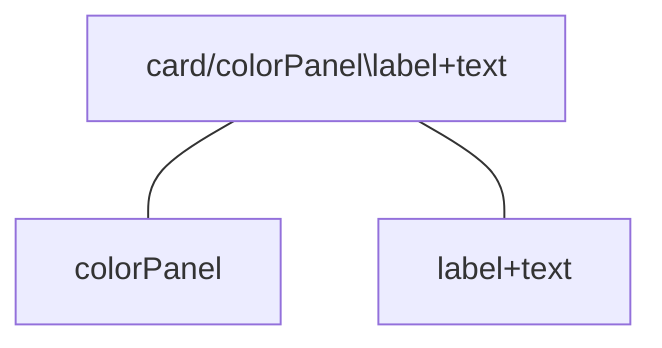
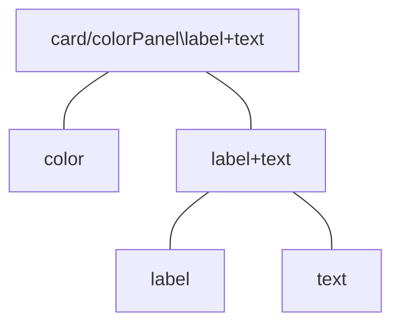
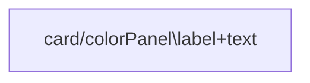
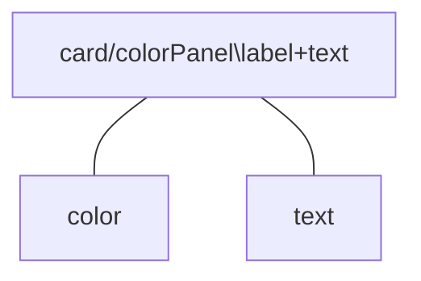

# Full-stack Project Planning Checklist

**incomplete**

## Scope {collapsible="true" default-state="expanded"}

Check which you need to include in a project:

- [ ] Backend
- [ ] Frontend
- [ ] User authentication
- [ ] External/third-party APIs
    - APIs:

## User Stories {collapsible="true" default-state="expanded"}

- this is what you want your users to see or to do when accessing your site/app

Example:

> As a user, I should be able to create an account
>
> As a user, I should be able to navigate the recommended dashboard and select and see details of the recommended stock
>
> As a user, I should be able to create a new portfolio that holds my stocks
>
> As a user, I should be able to search for a stock and add that stock to the selected portfolio
>
> As a user, I should be able to delete a portfolio or stock from that portfolio

## Database Modeling {collapsible="true" default-state="expanded"}

You should draw a diagram of your models and connect with their relationship

- What type of database will you use? (i.e., relational or non-relational):
- What database models/schemas will you need?
- If using a relational database, what relationships do you need between models?
- If using MongoDB, do you have a cluster available to put your collection in?

## API Endpoint Planning {collapsible="true" default-state="expanded"}

- Do you need full CRUD endpoints for every model?
- Do you plan to handle query parameters with your API?
- Which endpoints will be public and which are to be protected?
- How will you protect those endpoints that aren't publicly accessible?

## Backend Build {collapsible="true" default-state="expanded"}

- [ ] Ruby/Rails
- [ ] Node/Express
- [ ] Python/Django
- [ ] Python/Flask
- Where will you host your API?
- What type of user authorization?
    - [ ] Session tokens
    - [ ] OAuth
    - [ ] JWT
    - [ ] Other:
- Set up notification microservice that provides push notifications, emails, and SMS to users. Use separate channels for
  sending transactional and promotional SMS
- Create a base model that you can later use for every other model in the database
- Set up asynchronous communication so that users do not have to waste their time as the application sends out welcome
  emails.

## Backend Testing {collapsible="true" default-state="expanded"}

- Build tests as you go and use postman/insomnia for testing endpoints
- Document as you go as well

## Wireframe and Sketches {collapsible="true" default-state="expanded"}

- Sketch out a basic concept layout
- Use professional graphic tools to get a full picture of your application. Rather than sticking to designing from your
  code, launch graphic programs to see how your product will look.
- Research well on typography, good fonts can complement the design; try different combinations till you find the right
  match.
- Fonts:
- Colors:
- Style elements:

## Component Planning {collapsible="true" default-state="expanded"}

Again make a diagram

Component design:

1. Identify the major visual elements
    1. no visual element is minor at this point

1. Arrange your visuals into a tree-like structure (aka visual hierarchy)
    1. **GOAL:** is to identify the important visual elements and break them into a parent/child arrangement until you
       can divide them no further
    2. do **NOT** think of implementing details
    3. do **NOT** focus on dividing your visual elements based on what combination of HTML and CSS would be required

1. Identify the components
    1. which of the visual elements we've identified will be turned into a component
        1. **NOTE:** not every visual element will need to be turned into a component
    2. **GENERAL RULE:** components should do just one thing

Too few:

Too many:

Final Determination:

- [ ] Containers/components?
- Which components need to maintain state?
- What does each component render?
- Can you create a single source of truth for your app to keep your state in check?

## Frontend Build {collapsible="true" default-state="expanded"}

- [ ] React?
- [ ] Redux?
- [ ] Bootstrap?
- [ ] Material UI?

## Frontend Testing {collapsible="true" default-state="expanded"}

- Write out tests as you go
- What edge cases do you need to cover?
- How are you handling errors from a UI perspective?
- Does your app/site fail well?

## User Testing {collapsible="true" default-state="expanded"}

<seealso>
 |

</seealso>
