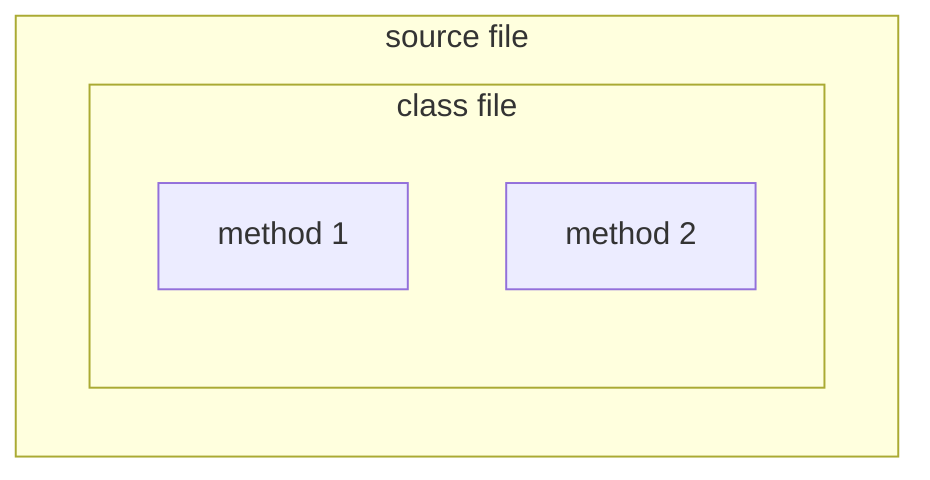
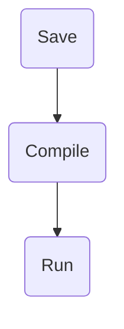

# Head First Java

**incomplete**

## Chapter 1 Breaking the Surface {collapsible="true" default-state="expanded"}

### The Way Java Works

1. **Source**: Create a source document (filename.java)
2. **Compiler**: Run the document through a source code compiler.
    1. this will check for errors and won't let you compile until it is satisfied
3. **Output (code)**: Compiler creates new file containing **bytecode**
    1. Java will be able to translate/interpret this file into something it can run
    2. The compiled bytecode is platform independent
4. **Virtual Machines**: A java virtual machine is used to run java bytecode code
    1. This is what makes java code machine independent

### What you'll do in Java

1. Type your source code
2. Compile your source file

`javac <sourcefile.java>`

3. This compiles the code and creates a `sourcefile.class` file

- this is the bytecode

4. Run the program

- `java sourcefile`
- This starts the Java Virtual Machine (JVM)
- The JVM translates the _bytecode_ into something the underlying platform understands

### Code structure in Java



- **Put a <span style="color:grey">class</span> in a source file**
- **Put <span style="color:grey">methods</span> in a class**
- **Put <span style="color:grey">statements</span> in a method**

#### What goes in a <span style="font-size: 24px">source</span> file?

- source code file holds one **_class_** definition

```java
public class Dog {

}
```

#### What goes in a <span style="font-size: 24px">class</span>?

- a class has one or more **_methods_**
- the method holds instructions on what that method should do
- the method must be declared _inside_ a class

```java
public class Dog {
  void bark() {

  }
}
```

#### What goes in a <span style="font-size: 24px">method</span>?

- within the curly braces of a method, write the instructions for how that method should be performed
- method _code_ is basically a set of statements

```java
public class Dog {
  void bark() {
    statement1;
    statement2;
  }
}
```

### Anatomy of a class

When the JVM starts running, it looks for the class you gave it at the command line. Then is starts looking for a
specially written method that looks exactly like:

```java
public static void main (String[] args){
  // your code goes here
}
```

Next, the JVM runs everything between the curly braces of your main method. Every Java application has to have at least
one **class**, and at least one **main** method (main per application not per class)


### Writing a class with a main

- everything goes into a **class**
- running a program tells the JVM to load **<AppName>** class, then start executing the **main()** method
- keep running till all the code in the main method is finished
- **main()** method is the entry point of the whole app

Remember:



#### Syntax Fun

- each statement must end in a semicolon `x = x + 1;`
- a single-line comment begins with two forward slashes `// single-line comment`
- most white space does not matter ` x = 3 ;`
- variables are declared with a **name** and a **type** `int weight`
- classes and methods must be defined within a pair of curly braces

```java
public void go() {
  // code goes here
}
```

### Looping and looping and...

Java jas three main looping constructs:

1. while
2. do-while
3. for

Concentrate on the _while_ loop for now

- **while** some condition is true, do everything inside the loop _block_
- key to a loop is the _conditional test_

#### Simple boolean tests

- do a simple boolean test by checking the value of a variable, using a _comparison operator_ including:
    - `<` (less than)
    - `>` (greater than)
    - `==` (equality)

```java
int x = 4; // assign 4 to x
while(x > 3) {
  // loop code will run because x is greater than 3
  x = x - 1; // or we'd loop forever
}
int z = 27;
while(z == 17) {
  // loop code will not run because z is not equal to 17
}
```

_while loop example: Loopy.java_

```java
public class Loopy {
  public static void main (String[] args){
    int x = 1;
    System.out.println("Before the loop");
    while(x < 4) {
      System.out.println("On the loop");
      System.out.println("Value of x is " + x);
      x = x + 1;
    }
    System.out.println("After the loop!");
  }
}
```

_output_

```bash
javac Loopy.java
java Loopy

Before the loop
In the loop
Value of x is 1
In the loop
Value of x is 2
In the loop
Value of x is 3
After the loop!
```

> :paperclip: **BULLET POINTS**:
>
> - Statements end in a semicolon `;`
> - Code blocks are defined by a pair of curly braces `{}`
> - Declare an _int_ variable with a name and a type: `int x;`
> - The **assignment** operator is _one_ equals sign `=`
> - The **equals** operator uses _two_ equals signs `==`
> - A _while_ loop runs everything within its block (defined by curly braces) as long as the _conditional test_ is *
    *true**
> - If the conditional test is **false**, the while loop code block won't run, and execution will move down to the code
    immediately _after_ the loop block
> - Put a boolean test inside parentheses: `while (x == 4) {}`

### Conditional branching

An _if_ test is basically the same as the boolean test in a _while_ loop - except instead of saying "**_while_**
this..." you'll say, "**_if_** there is..."

_IfTest.java_

```java
class IfTest {
  public static void main(String[] args){
    int x = 3;
    if (x == 3){
      System.out.println("x must be 3");
    }
    System.out.println("This runs no matter what");
  }
}
```

In the example above, if the statement is true, then two statements will print out, but regardless, at least one
statement will always print.

_output_

```bash
javac IfTest.java
java IfTest
x must be 3
This runs no matter what
```

Now, we can add an _else_ to the condition, so that we can say something like "_if_ this then do this _else_ do this..."

_IfTest2.java_

```java
class IfTest2 {
  public static void main(String[] args){
    int x = 2;
    if (x == 3){
      System.out.println("x must be 3");
    } else {
      System.out.println("x is NOT 3");
    }
    System.out.println("This runs no matter what");
  }
}
```

_output_

```bash
javac IfTest2.java
java IfTest2
x is not 3
This runs no matter what
```

_BeerSong.java_

```java
public class BeerSong {
  public static void main(String[] args){
    int bottleCount = 99;
    String word = "bottles";

    while(bottleCount > 0){

      System.out.println(bottleCount + " " + word + " of beer on the wall.");
      System.out.println(bottleCount + " " + word + " of beer.");
      System.out.println("Take one down. Pass it around.");
      bottleCount = bottleCount - 1;

      if(bottleCount > 0){
        if(bottleCount == 1){
          word = "bottle";
        }

        System.out.println(bottleCount + " " + word + " of beer on the wall.");
      } else {
        System.out.println("No more bottles of beer on the wall.");
      }
    }
  }
}
```

## Glossary {collapsible="true"}

A definition list or a glossary:

First Term
: This is the definition of the first term.

Second Term
: This is the definition of the second term.
