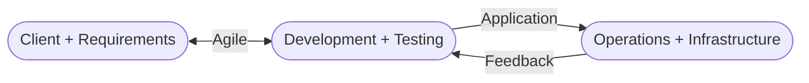

# Introduction to DevOps Tools

**incomplete**

## All About DevOps {collapsible="true" default-state="expanded"}

DevOps culture is implemented in several phases with the help of several tools

### Dev

1. Plan
2. Code
    1. [](https://git-scm.com)
3. Build
    1. [](https://maven.apache.org)
    2. [](https://gradle.org)
4. Test
    1. [](https://www.selenium.dev)

Integrate

1. [](https://www.jenkins.io)

### Ops

1. Deploy
2. Operate
    1. [](https://www.ansible.com)
    2. [](https://www.docker.com)
    3. [](https://kubernetes.io)
    4. Monitor
        1. [Nagios](https://www.nagios.org)


[ref](https://d1jnx9ba8s6j9r.cloudfront.net/blog/wp-content/uploads/2019/06/DevOps-Tools-DevOps-Tutorial-Edureka-1.png)

### Waterfall Model

- Waterfall model is a traditional approach of software development
- In the waterfall model, development happens in a step-by-step manner


[ref](https://www.tech-faq.com/waterfall-model.html)

1. **Requirement analysis**
    - programmers accept the client requirements and analyze them
2. **Design**
    - programmers then come up with a project plan and a design architecture
3. **Development/Implementation**
    - programmers code the application as per project plan and design
4. **Testing/Verification**
    - testing ensures the application is error-free and meets the requirements
5. **Maintenance**
    - after the application is delivered, the operations team maintains the application

Disadvantages:

- Any new requirements from the client will restart the development cycle
- If a client is unhappy with the product, the entire project cycle is restarted
- Until the requirements are not clear, the project cannot start and is eventually delayed

Using the waterfall model, companies soon came to realize:

1. client requirements cannot be understood at once
2. it is costly to make changes during the end of the project
3. software must be delivered faster and with fewer resources

### Agile Model

Following the Agile model, programmers create prototypes to understand client requirements

1. client sends his requirements to the programmer
2. programmer creates a prototype of the application
3. client provides feedback and list of changes to be made

The entire process of building a software is broken down into small actionable blocks called sprints (usually
approximately 2 weeks long)

Agile Ceremony


- Plan
- Code
- Test
- Review

Advantages:

- client requirements are better understood because of the constant feedback
- the product is delivered much faster as compared to a waterfall model

Disadvantages:

- product gets tested only on developer computers and not on production systems
- developers and operations team work in separate silos
    - when the product fails in production servers, the operations team is clueless and sends the product back to the
      development team

Agile Model


### What is DevOps?

- DevOps is an evolution from Agile model of software development


- Agile addressed the gap between the development team and the operations team

1. the development team will submit the application to the operations team for Implementation
2. operations team will monitor the application and provide relevant feedback to developers



### DevOps Phases

According to DevOps practices, the workflow in software development and delivery is divided into 8 phases


[ref](https://spectralops.io/blog/the-essential-guide-to-understanding-the-devops-lifecycle/)

1. Plan
    1. business owners and software development team discuss project goals and create a plan
2. Code
    1. programmers then design and code the application and use tools like Git to store application code
3. Build
    1. build tools like Maven and Gradle, take code from different repositories and combine them to build the complete
       application
4. Testing
    1. application is tested using automation testing tools like Selenium and JUnit to ensure software quality
5. Integrate/Release
    1. when testing is complete, new features are integrated automatically to the already existing codebase
6. Deploy
    1. the application is packaged after release and deployed from development server to production server
7. Operate
    1. once software is deployed, an operations team performs activities such as configuring servers and provisioning
       them
       with the required resources
8. Monitor
    1. monitoring allows IT organization to identify specific issues of specific releases and understand the impact on
       end-users

### DevOps Tools


[ref](https://dzone.com/articles/how-to-orchestrate-devops-tools-together-to-solve)

### DevOps Process

Continuous Delivery


### DevOps Advantages

Companies which follow DevOps, release more products and features within a short amount of time

- Time taken to create and deliver software is reduced
- Complexity of maintaining an application is reduced
- Improved collaboration between developers and operations team
- Continuous integration and delivery ensure faster time to market

## Git and GitHub {collapsible="true" default-state="expanded"}

### Version Control System (VCS)

It allows all files to be stored in a single repository (repo) and also allows for easy collaboration on those files.

- all files in System A are stored as Version 1 in the remote repository
- someone wants to make changes to those files in the repo, they check them out, make the changes and then push them
  back onto the remote repo, thus updating the version history to Version 2

VCS allows you to store multiple versions of a system file in the remote repo

### Distributed Version Control System

Ability for the code to be shared across a team of developers

- All the developers have the entire copy of code on their local system
- Distributed VCS moves from client-server approach of Central VCS to peer-to-peer approach

Git tool is an example of Distributed VCS


[ref](https://homes.cs.washington.edu/~mernst/advice/version-control.html)

### What is Git?

Git is a distributed version control tool used for source code management

- used to track the changes in the source code
- allows multiple developers to work together
- supports non-linear development because of thousands of parallel branches
- has the ability to handle large projects efficiently

GitHub is the server


[ref](https://www.c-sharpcorner.com/article/git-and-github-version-control-local-and-remote-repository/)

### Git vs GitHub

|                        git                         |                   github                   |
|:--------------------------------------------------:|:------------------------------------------:|
|                   software tool                    |                  service                   |
|                 installed locally                  |             hosted on the web              |
|   manages different versions of the source code    | houses a copy of the local repository code |
| provides a command line to interact with the files |     provides a gui to store the files      |


[ref](https://i.stack.imgur.com/jwCeV.png)

### Git Architecture

- Local
    - Working Directory
        - folder where you are currently working
    - `git add` to staging area
        - you add your files to the staging area before making a commit
    - `git commit` to local repository
        - after making all the changes, you commit those files to the local repository
- Remote
    - `git push` to remote repository
        - you can push the committed files to the remote repository
    - `git pull` from remote repository
        - fetches all the changes from a remote repository to a local repository
- Local
    - `git checkout` from local repository
        - you can create new branches and switch to them as and when required
    - `git merge`
        - after you are done with the changes, you can merge the new branches to the master branch


### Git Concepts

1. [Fork and Clone](#fork-and-clone)
2. [Adding Collaborators](#collaborators)
3. [Branch in Git](#git-branch)
4. [Pull from a remote](#pull-from-a-remote)
5. [Git Rebase](#git-rebase)

#### Fork and Clone

Git allows you to fork an open-source repository. When you fork a repository, you create a copy of it on your GitHub
account.


#### Collaborators

GitHub allows you to work with users from all over the world at any given time.

- Collaborators are GitHub users who are given permission to edit a repository owned by someone else
    - Access all the files
    - View the files
    - Make changes to the files
    - Commit the files

#### Git Branch

You can create a new branch and build a new feature on that branch

- by default, you always work on the main branch


Branch in Git is used to keep your changes until they are ready

**Git Merge**


#### Pull from a remote

You can pull in any changes that have been made from your forked remote repository to the local repository

```bash
$ git pull <remoteName> <branchName>
```

- if there is no change, it will notify "Already up to date." If there is a change, it will merge those changes to your
  local repository

#### Git Rebase

Git rebase is the process of combining a sequence of commits to a new base commit

- the primary reason for rebasing is to maintain a linear project history
- when you rebase, you "unplug" a branch and "replug" it on the tip of another branch (usually main)
- the goal of rebasing is to take all the commits from a feature branch and put it on the main branch


The Resulting history is linear with no divergent branches

- reduces the total storage space needed

### Popular Git Commands

- :red_circle: `git init`: initialize a local git repository
- :red_circle: `git add`/`git add .`: add one or more files to a staging area
- :red_circle: `git commit -m "some commit message"`: commit changes to head but not to the remote repository
- :red_circle: `git status`: check the status of your current repository and list the files you have changed
- :red_circle: `git log`: provides a list of all commits made on your branch
- :red_circle: `git diff`: view the changes you have made to the file
- :red_circle: `git push origin <branch name>`: push the branch to the remote repository so others can use it
- :red_circle: `git config --global user.name "User Name"`: tell git who you are by configuring the author name
- :red_circle: `git config --global user.email "email@example.com"`: tell git who you are by configuring the author
  email id
- :red_circle: `git clone`: create a git repository copy from a remote source
- :red_circle: `git remote add origin <server>`: connect your local repository to the remote server and add the server
  to be able to push to it
- :red_circle: `git branch <branch name>`: create a new branch
- :red_circle: `git checkout <branch name>`: switch from one branch to another branch
- :red_circle: `git merge <branch name>`: merge a branch into the active branch
- :red_circle: `git rebase`: reapply commits on top of another base tip

## All About Jenkins {collapsible="true" default-state="expanded"}

### Before Jenkins

- Developers had to wait till the entire software code was built and tested to check for errors
- Developers had to check the entire source code to find the errors. In such cases, fixing bugs was very difficult
- There was no iterative improvement of code and software delivery process was slow

### What is Jenkins

- a Continuous Integration tool that allows continuous development, test and deployment of newly created code

_Nightly build and integration_

- the team needs to commit and push all code by some arbitrary time (usually end of the work day)


_Continuos Integration_

- the team no longer has an arbitrary time to push code, now they can commit and push whenever it is feasible to do so
- test and verification services are now built into the environment, so whenever the developer pushes the code to the
  repo, it can be tested and verified during the push


### What is Continuous Integration

- developer writes and submits code to a repository
- repository sends the code to a Continuous Integration (CI) server
- CI server runs tests against the code and if it fails, then sends it back to the developer to fix
    - This allows the developer to do two things:
        - to not break the build
        - to not run all the tests locally on their machine
    - If pass, go on to the tester to run more tests than the standard tests the CI server runs
        - if the tester catches errors, then they can send directly back to the developer
- **GOAL:** Release and deploy

### Continuous Integration Tools

- **Bamboo**
    - can run multiple builds in parallel for faster compilation
    - it has built in functionality to connect with repositories and has build tasks for Ant, Maven, etc.
- **Buildbot**
    - an open-source framework for automating software build, test, and release processes
    - it is written in Python and supports distributed, parallel execution of jobs across multiple platforms
- **Apache Gump**
    - designed with the aim to build and test all the open-source Java projects every night
    - it makes sure that all the projects are compatible at both API level and functionality level
- **Travis CI**
    - it is a hosted, distributed continuous integration service used to build and test software projects hosted at
      GitHub
    - it's built for projects and teams of all sizes and supports over 20 different languages
- **Jenkins**
    - it is an open-source automation server written in Java
    - used to automate software development process via continuous integration facilitates continuous delivery

### Features of Jenkins

1. Easy installation
    - self-contained Java-based program, ready to run with packages for Windows, Mac OS X, and Unix-like OS
2. Easy configuration
    - it can easily set up and configured via its web interface, which includes error checks and built-in help
3. Plugins
    - it has hundreds of plugins in the Update Center and integrates with every tool in the CI and CD toolchain
4. Extensible
    - it can be extended via its plugin architecture and provides nearly infinite possibilities for what it can do
5. Distributed
    - it can easily distribute work across multiple machines, helping in faster builds, tests, and deployments across
      multiple platforms

### Jenkins Pipeline


[source](https://www.lambdatest.com/blog/jenkins-pipeline-tutorial/)

### Jenkins Architecture


- Broken up into two sections
    - Section 1
        - Developers commit changes to the source code
    - Section 2
        - Jenkins server checks the repository at regular intervals and pulls any newly available code
        - Build Server (such as Maven) builds the code into an executable file
            - In case the build fails, feedback is sent to the developers
        - Test Server (such as Selenium) for testing
            - if the test fails, feedback is immediately passed on to the developers

> If you have different code files
>
> - The files could be very large and may require multiple builds
> - Singe Jenkins server cannot handle multiple files and builds
>
> Need to distribute Jenkins architecture to overcome such issues

### Jenkins Master-Slave Architecture


- Jenkins master distributes its workload to all the slaves
- On request from Jenkins master, the slaves carry out builds and tests and produce test reports

### Jenkins Installation

- Web-Application written in Java can be run/installed in 3 ways:

1. Windows or Linux/Unix services
2. Generic war file
3. Install on any Java-based web servers—Apache Tomcat

### Jenkins Prerequisites

- There are some prerequisites to install Jenkins
    - Java Development Kit (JDK 1.7 or 1.8)
    - 2GB RAM
    - Set environment variable JAVA_HOME to point to JDK base directory
        - ex: `C:\Program Files\Java\jdk1.8.0_162`

### Jenkins root folder

Jenkins stores all its configuration data, jobs and project workspace in a Root/Parent folder

- `C:\Program Files (x86)\Jenkins or`
- `C:\User_Home_Dir\.Jenkins`

## Docker and Its Installation {collapsible="true" default-state="expanded"}

### What is Docker?

Docker is a tool used to automate the deployment of applications in lightweight containers so that applications
can work efficiently in different environments

An OS-level virtualization software platform that enables developers and IT administrators to create, deploy and run
applications in a Docker Container with all their dependencies

- Multiple containers run on the same hardware
- Maintains isolated applications
- Highly productive
- Quick and easy configuration

> 📎 NOTE:
>
> Docker Container is a lightweight software package that includes all the dependencies (frameworks, libraries, etc.)
> required to run an application.


### How does Docker work?


- <span style="color:red">Docker Engine or Docker</span> is the base engine install on your host machine to build and run containers using Docker components and services
- It uses a <span style="color:red">client-server</span> architecture
- Docker Client and Server communicate using <span style="color:red">Rest API</span>
- Docker Client is a service that runs a command. The command is translated using REST API and is sent to the Docker
  Daemon (server)
- Then, Docker Daemon checks the client request and interacts with the operating system in order to create or manage
  containers

### Components of Docker


1. Docker Client and Server (Engine)
2. Docker Images
3. Docker Containers
4. Docker Registry

#### Docker Client and Server (Engine)

- Docker Client is access from the terminal, and a Docker Host runs the Docker Daemon and registry
    - CLI command which used to issue commands to the Docker Daemon
    - Uses REST API to issue commands to Docker Daemon through scripting or direct CLI commands
- A user can build Docker Images and run Docker Containers by passing commands from the Docker Client to Docker server
- Docker engine or Docker is a client server application that builds and executes containers using Docker components
- REST API is a primary mode of communication between Docker Client and Docker Daemon
- Docker toolbox is used for older Windows and Mac systems with the following features

    - Docker engine
    - Docker machine
    - Docker compose
    - Kinematic

- Docker Daemon is a server that interacts with the operating system and performs all kinds of services
    - listens for REST API request and performs the operation
    - A command <span style="color:red">_**dockerd**_</span> is used to start a Docker Daemon
    - interacts with the operating system in order to create or manage Docker Containers
- Docker Host runs the Docker Daemon and Registry

> 📎 <span style="color:red">NOTE:</span>
>
> The machine running the Docker server is called as Docker Host

#### Docker Image

- Docker Image is a template with instructions, which is used for creating Docker Containers (using YAML)
- A Docker Image is built using a file called a Docker File
- Docker Image is stored in a Docker Hub or in a repository (like registry.hub.Docker.com)
- It comprises multiple layers
    - by default, starts with a base layer
    - each layer depends on the layer below it
- Image layers are created by executing each command in the Dockerfile and are in read-only format
- Syntax to create a Docker Container using a Docker Image: `Docker container create [OPTIONS] IMAGE [COMMAND] [ARG...]`

> 📎 <span style="color:red">NOTE:</span>
>
> A Docker File is a text file that contains commands for building a Docker Image

Example:

FROM ubuntu:18.04
PULL ./file
RUN make /file
CMD python /file/file.py

- Whenever a user creates a container, a new layer is formed on top of the image layers called container layer
- Every container has a separate (R/W) container layer, and any modification in a container is reflected upon the
  container layer alone
- When a container is deleted, the top layer also gets deleted

What should be done when there is a change in image layer?

- Users can add a new layer to the base image
- But, users cannot modify any of the existing image layers

- Base layers are in read only format
- The layers can be combined in a union file system to create a single image
- Union file system saves memory space by avoiding duplicating of files
- This allows a file system to appear as writable (but without modifying the file) which is known as copy-on-write

#### Docker Container


- Docker Container is a standalone, executable software package that includes applications and their dependencies
- Numerous Docker Containers run on the same infrastructure and share an operating system (OS) with its other containers
- Here, each application runs in isolation

#### Docker Registry

- Docker Registry is an open-source server-side service used for hosting and distributing images
- Docker also has its own default registry called Docker Hub
- Here, images can be stored in either public or private repositories
    - Public repositories can be used to host Docker Images which can be used by everyone
    - Private repositories allow a user to store Docker Images that he/she wants to keep private
- Pull and Push are the commands used by users to interact with a Docker Registry
- To build a container, <span style="color:red">pull</span> command is used to get a Docker Image from the
  Docker repository

`Docker pull < image >:< tag >:` <span style="color:red">pulls</span> an image from DTR

- With <span style="color:red">push</span> command, a user can store the Docker Image in Docker Registry

`Docker push < image >:< tag >:` <span style="color:red">pushes</span> an image to DTR

- In Registry, a user can distinguish between Docker Images with their tag names

> 📎 NOTE:
>
> A tag is an alphanumeric identifier attached to an image

- In Docker Registry, deleting a repository is not a reversible action

### Virtual Machine vs Docker


Major differences are:

| Virtual Machine |      vs      |       Docker       |
|:---------------:|:------------:|:------------------:|
|       📈        | Memory Usage |         📉         |
|       👎        | Performance  |         👍         |
|       :x:       | Portability  | :white_check_mark: |
|     :snail:     | Boot-up time |      :rocket:      |

- VM - if you allocate 9 GB of memory and use only 3 GB leaving 6 GB free, you cannot use that 6 GB for anything else.
- Docker—if you allocate 9 GB, and 6 GB are free, those 6 GB can be reused for another container.
- VM - running multiple virtual machines leads to <span style="color:brown">unstable performance</span>
- Docker—containers have a <span style="color:brown">better performance</span> as they are hosted on a single Docker
  Engine
- VM—<span style="color:brown">Portability issues</span> while executing applications in different platforms
- Docker—Multiple software can be encapsulated in a single container and <span style="color:brown">can be easily
  deployed</span> to different platforms
- VM - takes long boot-up time (minutes)
- Docker—Takes <span style="color:brown">less boot-up</span> time (milliseconds)

### Advantages of Docker

- Rapid Deployment
- Portable
- Better Efficiency
- Faster Configuration
- Scalability
- Security

## Docker Container {collapsible="true" default-state="expanded"}


- Docker Container is an executable package of application and its dependencies together
- Since it's light-weight, it can be easily deployed and executed on other computer environments regardless of their
  host OS/ configurations
- Docker Containers run applications in isolation and also share the OS kernel with other containers


- Here, data volumes can be shared and reused among multiple containers
- It is built using Docker Images
- Docker _run_ command builds a container

Consider a basic example of Docker <span style="color:red">run</span> command for starting a
single <span style="color:red">redis</span> container

- Suppose a user runs `Docker run redis` command, the following happens:
    - In case you don't have a Docker Image locally, the Docker pulls the image from your Registry
    - Now, Docker creates a new container <span style="color:red">redis</span> from the existing Docker Image

How are containers lightweight?

- Docker Containers are lightweight because they do not require an extra layer of a hypervisor and run directly on the
  host operating system

### Advanced concepts in Docker

#### Docker Compose


- Docker Compose is used for running multiple containers as a single service
- Here, each container runs in isolation but can interact with each other
- All Docker Compose files are YAML files

For example:

If you have an application which requires Apache server and MySQL database, you could create one Docker Compose file
which can run both containers as a service without the need to start each one separately

| Docker Compose                                                       | Docker Swarm                                                                        |
|----------------------------------------------------------------------|-------------------------------------------------------------------------------------|
| It creates multiple containers on a single host                      | It creates multiple containers on multiple hosts                                    |
| It uses YAML file to manage different containers as a single service | It doesn't use any file but helps you to manage different Docker hosts in a cluster |


#### Docker Swarm


- Docker Swarm is a service for containers which allows IT administrators and developers to create and manage a cluster
  of swarm nodes within the Docker platform
- Each node of Docker Swarm is a Docker Daemon, and all Docker Daemons interact using the Docker API
- Services can be deployed and accessed by nodes of the same cluster
- Creating a service, a user has to specify which container image to use
- Service is either global or replicated
    - A global service will run on every Swarm node
    - A replicated service, the manager node distributes tasks to worker nodes
- A service is a description of a task or the state, whereas a task does the work
- Docker enables a user to create services which can start tasks
- When a task is assigned to a node, it cannot be assigned to another node
- Swarm node has a backup folder, in case the main node fails, it can be used to restore the data onto a new swarm
- Containers are launched using services
    - a service is a group of containers of the same image
    - services enables to scale your application
- Before you can deploy a service in Docker Swarm, you must have at least one node deployed
- A swarm consists of two types of nodes:
    - Manager node
    - worker node


- Manager node maintains cluster management tasks
    - reschedule containers on node failures
    - knows the status of all worker nodes in a cluster
    - it is possible to have multiple manager nodes, but there can only be one primary manager node, which gets elected
      by the other Manager nodes
- Worker nodes receive and execute tasks from manager node
    - has an agent, which reports on the state of the node's tasks to the manager
    - communicate with the manager node using a REST API over HTTP

#### Features

- Decentralized access
- High security
- Auto load balancing
- High scalability
- Roll-back a task

### Basic Docker commands

| Tasks                             | Commands                            |
|-----------------------------------|-------------------------------------|
| Install                           | `yum install docker`                |
| Start Docker daemon               | `systemctl start docker`            |
| Remove Docker image               | `docker rmi <ImageID>`              |
| Download an image                 | `docker pull <image_name>`          |
| Run an image                      | `docker run <ImageID>`              |
| Pull am image from a Docker hub   | `docker pull <image_name:tag>`      |
| Build an image from a Docker file | `docker build -t[image_name]:tag`   |
| Shut down container               | `docker stop <ContainerID>`         |
| Access a running container        | `docker exec it <ContainerID> bash` |

### What is a Docker Container?

#### Why Docker Container?


> 📓 NOTE:
>
> Guest OS occupies more space and leads to unstable performance


## Kubernetes on AWS {collapsible="true" default-state="expanded"}

### What are Orchestration Tools?

Orchestration tools are a set of commands used to deploy and connect an application. These tools focus on the process
and not their outcome.

There are numerous orchestration tools. The two most important are Docker Swarm and Kubernetes.

### Docker Swarm vs Kubernetes

|                        | Docker Swarm                                         | Kubernetes                                                             |
|------------------------|------------------------------------------------------|------------------------------------------------------------------------|
| Scaling                | No auto scaling                                      | Auto scaling                                                           |
| Load Balancing         | Auto load balancing                                  | Manually configures load balancing                                     |
| Installation           | Easy and fast                                        | Long and time-consuming                                                |
| Scalability            | Cluster strength is weak when compared to Kubernetes | Cluster strength is strong                                             |
| Storage Volume Sharing | Shares storage volumes with any other container      | Shares storage volumes between multiple containers inside the same Pod |
| GUI                    | Not available                                        | Available                                                              |

> 📓 NOTE:
> Both are container management. However, Docker Swarm only manages Docker Containers. Kubernetes can manage any
> container to include Docker Containers.

### Kubernetes Architecture


- Kubectl is the workstation used for running Kubernetes commands (cli)
- Master Node
    - The master node is the most vital component responsible for Kubernetes architecture
    - There is always one node to check for fault tolerance
    - The master node has various components like:
        1. ETCD (Cluster store)(Key-value pairs)
            - This component stores the configuration details and essential values
            - It communicates with all other components to receive the commands and work in order to perform an action
            - It also manages network rules and post forwarding activity
        2. Controller Manager
            - It is a daemon (server) that runs in a continuous loop and is responsible for gathering information and
              sending it to the API server
            - It works to get the shared set of clusters and change them to the desired state of the server
            - The key controllers are replication controller, endpoint controller, namespace controller, and service
              account controllers
            - The controller manager runs controllers to handle nodes, endpoints, etc.
        3. Scheduler
            - The Scheduler assigns the tasks to the slave nodes
            - It is responsible for distributing the workload, and it stores resource usage information of every node
            - It tracks how the working load is used on clusters and places the workload on the available resources
        4. API Server
            - It acts as an entry point for all REST commands used for controlling the clusters
            - it implements an interface which makes different tools and libraries to communicate effectively
- Worker/Slave Nodes
    1. Pod
        - It is a combination of containers that logically run together on nodes
    2. Docker (container runtime) (does not have to Docker)
        - It helps in running the applications in an isolated but lightweight operating environment. It runs the
          configured pods.
    3. Kubelet
        - It is a service responsible for conveying information to and fro to the control plane service
        - It gets the configuration of a Pod from the API server and ensures that the containers are working efficiently
        - The Kubelet process is responsible for maintaining the work status and the node server
    4. Kubernetes Proxy
        - It acts as a load balancer and network proxy to perform service on a single worker node
        - It manages pods on nodes, volumes, secrets, creation of new containers, health check-ups, etc.
        - It is a proxy service that runs on every node and helps in making services available to the external host

## Ansible {collapsible="true" default-state="expanded"}

### What is Ansible?

A tool that provides:

1. IT automation
    - instructions are written to automate the IT professional's work
2. Configuration management
    - allows a small IT team to configure a large number of systems with code (YAML)
    - consistency of all systems in the infrastructure is maintained
    - makes configuring a large amount of systems easier for a few IT personnel
    - automates the same task that needs to be repeated multiple times
    - reduces human error by automating the task using code vs. manual configuration
3. Automatic deployment
    - applications are deployed automatically in a variety of environments


- Pull configuration: Nodes check with the server periodically and fetch the configuration from it
- Push configuration: Server pushes configuration to the nodes
    - entire control lies with your master/server system
        - write your configuration files in YAML
    - responsible to push the configuration onto your remote node/client

Ansible, unlike Chef and Puppet, is a "push" type of configuration management tool

- advantage of a push configuration tool over pull configuration tool
    - unlike a pull type, no extra overhead weight of client software installed on the remote machines and no need for
      constant communication back to the server/master

### Why Ansible?

- falls on the operations side of the DevOps equation
- code is written once for the installation and deployed multiple times
    - it allows IT personnel to work on more productive tasks rather than repetitive ones

#### Advantages

1. **Agentless**—no additional software or plugins need to be installed on client systems
2. **Efficient**—no additional software means there is more space for other resources
3. **Flexible**—can adapt to changes in the infrastructure very easily
4. **Simple**—playbooks are written in YAML
5. **Idempotent**—playbooks can be applied multiple times without changing the result
6. **Automated Reporting**—each task in Ansible is named, and a report is generated every time they are executed

### Ansible Architecture


1. **Local Machine**: store all configuration files to be pushed to the remote machines
    - connects to the nodes through an SSH client
    - this is where Ansible is installed
2. **Nodes**: systems to be configured
    - controlled by the local machine
3. **Module**: a collection of configuration code files called playbooks
4. **Inventory**: a document that groups the nodes under specific labels
    - managed by the local machine

### Configuration

1. Inventory file (host file) - contains your groups

- maintain the structure of our network environment
- classifies nodes into groups
-
    - host names of the nodes are specified under group names


1. Playbooks
    - all the configuration files that are written for Ansible
    - written in YAML
    - core of Ansible
    - set of instructions to configure the nodes

_playbook file example_

```yaml
---
- name: playbook1 name
  hosts: webservers
  remote_user: root
  become: true
  tasks:
    - name: install apache
      yum:
        name: apache
        state: latest
    - name: start apache
      service:
        name: apache
        state: start
    - name: create content
      copy:
        content: 'Congrats on installing Ansible'
        dest: /var/www/html/index.html
- name: playbook2 name
  hosts: databaseservers
  tasks:
    - name: install MySQL
      yum:
        name: MySQL
        state: present
```

- **become** means you need to become root to execute the playbook (aka privilege escalation)
- **tasks** are actions the playbook needs to execute (httpd is basically Apache server)

- to check the syntax of the playbook: `ansible-playbook <playbook-file> --syntax-check`
- to push the playbook onto the remote node/client machine: `ansible-playbook <playbook-file>`

### Working with Ansible


- Ansible installed on local machine only
    - makes Ansible agentless
- playbook and inventory are written at the local machine
- local machine connects to the nodes through SSH
- local machine gathers the facts of each node
    - facts indicate the state of the nodes
- playbooks are sent to the nodes

### Ansible Tower

- created by Red Hat
- a framework for Ansible
    - Ansible is a CLI tool
    - Ansible Tower provides a GUI
    - reducing the dependency on the command prompt Windows
    - no need to type long commands, tasks can be performed in a single click

## FAQ DevOps Interview {collapsible="true" default-state="expanded"}

### Development

#### General DevOps Questions

1. How is DevOps different from Agile methodology?

- DevOps is a culture that allows the Development and the Operations team to work together. This results in Continuous
  Development, Testing, Integration, Deployment and Monitoring of the software throughout the lifecycle.


- Agile is a software development methodology that focuses on iterative, incremental, small and rapid releases of
  software along with customer feedback.


- Agile addresses gaps and conflicts between the Customer and Developers

2. What are the different phases in DevOps?


- Two main phases
    - Planning & Coding
    - Deploying

3. Mention some of the core benefits of DevOps.

| Technical benefits                               | Business benefits                                          |
|--------------------------------------------------|------------------------------------------------------------|
| Continuos software delivery                      | Faster delivery of features                                |
| Less complex problems to manage                  | Stable operating environments                              |
| Early detection and faster correction of defects | Improved communication and collaboration between the teams |

4. How will you approach a project that needs to implement DevOps?

- The following approaches can be used to implement devOps in a certain project:


1.

#### Source Code Management - Git

#### Continuos Integration \_ Jenkins

#### Continuos Testing - Selenium

### Operations

#### Configuration Management - Chef, Puppet, Ansible

#### Containerization - Docker

#### Continuos Monitoring - Nagios

<seealso>
[Simply Learn](https://lms.simplilearn.com/courses/4305/Introduction-to-Devops-Tools/syllabus)
</seealso>
