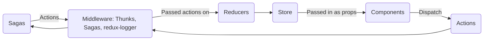
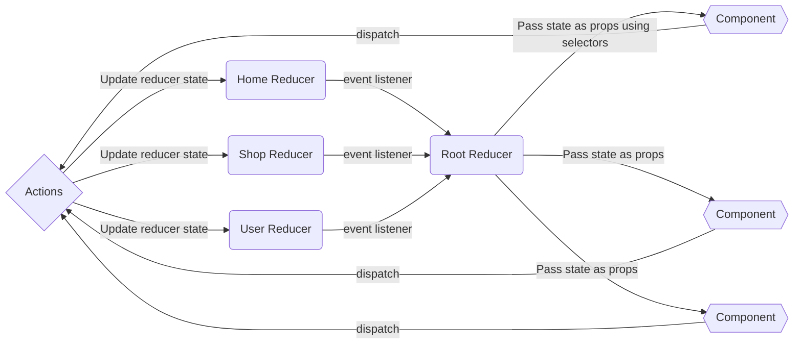

# Redux Thunk

**In-complete?**

## What is Thunk? {collapsible="true" default-state="expanded"}

- [Redux Thunk](https://github.com/reduxjs/redux-thunk) is middleware for Redux that allows writing functions with logic
  inside that can interact with Redux's store `dispatch` and `getState` methods.
- Thunk is a function that wraps an expression to delay its evaluation.

## Basic Understanding of Thunk {collapsible="true" default-state="expanded"}



- Thunk - if action is a function, Thunk will intercept and invoke the function, then dispatch actual action w/in
  function if exists
- Sagas - function that conditionally runs
    - the condition is based on whether or not a specific action is coming into the saga middleware
    - Example: a function listening fir fetch collections start action unless that action fires then that saga does not
      execute
    - can trigger other actions that go back into the middleware and continue into the reducers
    - handle the idea of side effects
        - Example: API call to a back end (async code) something triggers an impure reaction



- Action - is a plain JS object with a type field and optional other fields (payload)
    - an event that describes something that happened in an application

_typical action_

```javascript
const addTodoAction = {
    type: 'todos/todoAdded', // domain/eventName
    payload: 'Buy milk'
}
```

- Action Creators - a function that creates and returns an action object
    - typically used so we don't have to write teh action object by hand every time

```javascript
const addTodo = text => {
    return {
        type: 'todos/todAdded',
        payload: text
    }
}
```

- Reducer - function that receives the current state and an action object, decides how to update the state (if
  necessary) and returns the new state
    - think of it as an event listener which handles events based on received action (event) type

### Rules for reducers

1. should only calculate the new state value based on the state and action arguments
2. not allowed to modify existing state. Instead, they must make immutable updates, by copying existing state and make
   changes to teh copied values
3. they must not do any asynchronous logic, calculate random values, or cause other "side effects"

- typically follows the same series of steps:
    - check to see is reducer cares about this action
        - if so, make a copy of the state, update the copy with new values and return it
        - otherwise return the existing state unchanged

```javascript
const initialState = { value: 0 };

function counterReducer(state = initialState, action){
    // check to see if reducer care about this action
    if(action.type === 'counter/increment'){
        // if so, make a copy of state
        return{
            ...state,
            // update the copt with new value
            value: state.value + 1
        };
    };
    // otherwise return the existing state unchanged
    return state;
}
```

- Dispatch - only way to update the state
    - think of dispatching actions as triggering events
- Selectors - functions that know how to extract specific pieces of information from state value

<seealso>
<!--Give some related links to how-to articles-->
</seealso>
